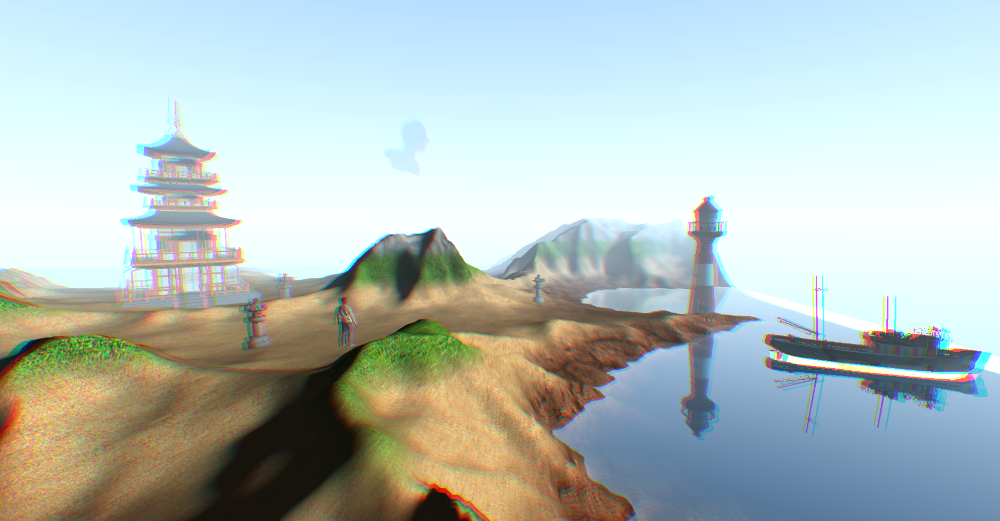

Graphics Programming in OpenGL
=
For this project I used:  
- C++
- OpenGL
- GLSL (Graphics library Shading Language)

The libraries I used are:
- GLFW
- glad
- glm
- stbi
- assimp

I made a tiny scene with a height map to terrain, water with water shader and imported models. 
